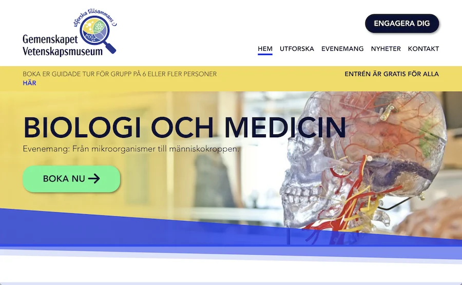

# Semester Project 1



A fictional museum website (Gemenskapet Vetenskapsmuseum) in Swedish language. Built for Semester Project 1 at Noroff. Designed with accessibility, responsiveness, and user engagement in mind, this site includes interactive pages for exhibitions, events, and visitor information.

## 📍 Live Site

[https://katjaturnsek.github.io/Semester-project-1/](https://katjaturnsek.github.io/Semester-project-1/)

## 💻 GitHub Repository

[https://github.com/KatjaTurnsek/Semester-project-1](https://github.com/KatjaTurnsek/Semester-project-1)

## 📝 Description

The project simulates a real-world website for a community science museum. It is aimed at both children and adults, promoting education through fun exhibitions, special events, and interactive learning.

Created to demonstrate early front-end development skills including responsive design, semantic HTML, and structured CSS.

### Key Features

- Home page with mission and featured exhibitions  
- Visit page with opening hours, ticket details, and location  
- Exhibition page with multiple categories and educational content  
- Contact form with basic validation  
- Accessible and mobile-friendly design  
- Includes alt text, clear headings, and proper navigation flow  

## 🔧 Built With

- HTML5  
- CSS3  

## 📦 Installation / Local Use

To run the project locally:

1. Clone the repository:
   ```bash
   git clone https://github.com/KatjaTurnsek/Semester-project-1.git
   ```
2. Open `index.html` in your browser

This is a static front-end project with no external API dependencies.

## 🙋‍♀️ Author

**Katja Turnšek**  
Frontend Development Student  
[Portfolio Website](https://katjaturnsek.github.io/portfolio-noroff/)
